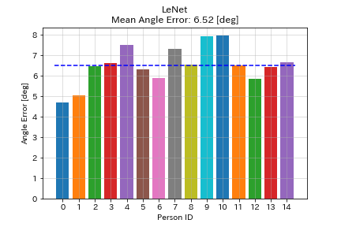
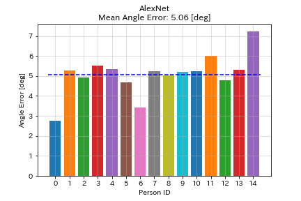
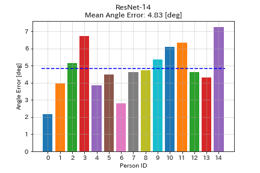

# An unofficial PyTorch implementation of MPIIGaze and MPIIFaceGaze

[](https://opensource.org/licenses/MIT)
[](https://github.com/hysts/pytorch_mpiigaze)

[Here](https://github.com/hysts/pytorch_mpiigaze_demo) is a demo program.
See also [this repo](https://github.com/hysts/pl_gaze_estimation).

## Requirements

* Linux (Tested on Ubuntu only)
* Python >= 3.7

```bash
pip install -r requirements.txt
```


## Download the dataset and preprocess it

### MPIIGaze

```bash
bash scripts/download_mpiigaze_dataset.sh
python tools/preprocess_mpiigaze.py --dataset datasets/MPIIGaze -o datasets/
```

### MPIIFaceGaze

```bash
bash scripts/download_mpiifacegaze_dataset.sh
python tools/preprocess_mpiifacegaze.py --dataset datasets/MPIIFaceGaze_normalized -o datasets/
```


## Usage

This repository uses [YACS](https://github.com/rbgirshick/yacs) for
configuration management.
Default parameters are specified in
[`gaze_estimation/config/defaults.py`](gaze_estimation/config/defaults.py)
(which is not supposed to be modified directly).
You can overwrite those default parameters using a YAML file like
[`configs/mpiigaze/lenet_train.yaml`](configs/mpiigaze/lenet_train.yaml).


### Training and Evaluation

By running the following code, you can train a model using all the
data except the person with ID 0, and run test on that person.

```bash
python train.py --config configs/mpiigaze/lenet_train.yaml
python evaluate.py --config configs/mpiigaze/lenet_eval.yaml
```

Using [`scripts/run_all_mpiigaze_lenet.sh`](scripts/run_all_mpiigaze_lenet.sh) and
[`scripts/run_all_mpiigaze_resnet_preact.sh`](scripts/run_all_mpiigaze_resnet_preact.sh),
you can run all training and evaluation for LeNet and ResNet-8 with
default parameters.


## Results

### MPIIGaze

| Model           | Mean Test Angle Error [degree] | Training Time |
|:----------------|:------------------------------:|--------------:|
| LeNet           |              6.52              |  3.5 s/epoch  |
| ResNet-preact-8 |              5.73              |   7 s/epoch   |

The training time is the value when using GTX 1080Ti.




<b> My Own Training Time </b> 
| Model           | Test Angle Error [degree] | Training Time [s/epoch] |
|:----------------|:-------------------------:|--------------:|
| LeNet           | ID 0: 4.201235771179199 <br> ID 1: 5.857380390167236 <br> ID 2: 6.206435680389404 <br> ID 3: 6.56096887588501 <br> ID 4: 5.819915294647217 <br> ID 5: 6.3475799560546875 <br> ID 6: 5.868472099304199 <br> ID 7: 7.9688591957092285 <br> ID 8: 6.652606010437012 <br> ID 9: 7.961040496826172 <br> ID 10: 6.87950325012207 <br> ID 11: 5.874270915985107 <br> ID 12: 6.095603942871094 <br> ID 13: 6.640603065490723 <br> ID 14: 5.9826836585998535 <br> <b> Mean: 6.327810573577881 </b> <br>|  ID 0:  <br> ID 1:  <br> ID 2:  <br> ID 3:  <br> ID 4:  <br> ID 5:  <br> ID 6:  <br> ID 7:  <br> ID 8:  <br> ID 9:  <br> ID 10:  <br> ID 11:  <br> ID 12:  <br> ID 13:  <br> ID 14:  <br> <b> Mean:  </b> <br>|
| ResNet-preact-8 | ID 0: 4.036035537719727 <br> ID 1: 4.759617805480957 <br> ID 2: 6.224761486053467 <br> ID 3: 5.100761413574219 <br> ID 4: 6.021407604217529 <br> ID 5: 6.4100799560546875 <br> ID 6: 5.680694580078125 <br> ID 7: 6.351699352264404 <br> ID 8: 6.108707904815674 <br> ID 9: 5.91240930557251 <br> ID 10: 5.642880916595459 <br> ID 11: 6.248713970184326 <br> ID 12: 5.415345668792725 <br> ID 13: 6.231785774230957 <br> ID 14: 5.865034580230713 <br> <b> Mean: 5.733995723724365 </b> <br>|  ID 0:  <br> ID 1:  <br> ID 2:  <br> ID 3:  <br> ID 4:  <br> ID 5:  <br> ID 6:  <br> ID 7:  <br> ID 8:  <br> ID 9:  <br> ID 10:  <br> ID 11:  <br> ID 12:  <br> ID 13:  <br> ID 14:  <br> <b> Mean:  </b> <br>|

The training time is the value when using RTX3090.

There is a slight difference with the training done by the sample code, as we did not set `cudnn benchmark = False`, `cudnn deterministic = True`

### MPIIFaceGaze

| Model     | Mean Test Angle Error [degree] | Training Time |
|:----------|:------------------------------:|--------------:|
| AlexNet   |              5.06              |  135 s/epoch  |
| ResNet-14 |              4.83              |   62 s/epoch  |

The training time is the value when using GTX 1080Ti.





<b> My Own Training Time </b> 
| Model           | Test Angle Error [degree] | Training Time [s/epoch] |
|:----------------|:-------------------------:|--------------:|
| Alexnet           | ID 0: 2.5926711559295654 <br> ID 1: 5.880463123321533 <br> ID 2: 5.201772212982178 <br> ID 3: 5.638153553009033 <br> ID 4: 4.7275776863098145 <br> ID 5: 4.894957542419434 <br> ID 6: 3.4403390884399414 <br> ID 7: 5.164022922515869 <br> ID 8: 5.124176979064941 <br> ID 9: 5.189162254333496 <br> ID 10: 5.192043781280518 <br> ID 11: 5.762932300567627 <br> ID 12: 5.050137519836426 <br> ID 13: 5.1160736083984375 <br> ID 14: 7.457568168640137 <br> <b> Mean: 5.09547012646993 </b> <br>|  ID 0:  <br> ID 1:  <br> ID 2:  <br> ID 3:  <br> ID 4:  <br> ID 5:  <br> ID 6:  <br> ID 7:  <br> ID 8:  <br> ID 9:  <br> ID 10:  <br> ID 11:  <br> ID 12:  <br> ID 13:  <br> ID 14:  <br> <b> Mean:  </b> <br>|
| ResNet-14 | ID 0: 2.1106247901916504 <br> ID 1: 5.465665817260742 <br> ID 2: 5.1382951736450195 <br> ID 3: 6.074862003326416 <br> ID 4: 3.6258327960968018 <br> ID 5: 4.259786605834961 <br> ID 6: 3.0125956535339355 <br> ID 7: 4.566280841827393 <br> ID 8: 4.682868480682373 <br> ID 9: 5.128609657287598 <br> ID 10: 5.466821670532227 <br> ID 11: 6.558365345001221 <br> ID 12: 4.866367340087891 <br> ID 13: 4.26247501373291 <br> ID 14: 7.144346237182617 <br> <b> Mean: 4.82425316174825 </b> <br>|  ID 0:  <br> ID 1:  <br> ID 2:  <br> ID 3:  <br> ID 4:  <br> ID 5:  <br> ID 6:  <br> ID 7:  <br> ID 8:  <br> ID 9:  <br> ID 10:  <br> ID 11:  <br> ID 12:  <br> ID 13:  <br> ID 14:  <br> <b> Mean:  </b> <br>|

The training time is the value when using RTX3090.

There is a slight difference with the training done by the sample code, as we did not set `cudnn benchmark = False`, `cudnn deterministic = True`


### Demo

This demo program runs gaze estimation on the video from a webcam.

1. Download the dlib pretrained model for landmark detection.

    ```bash
    bash scripts/download_dlib_model.sh
    ```

2. Calibrate the camera.

    Save the calibration result in the same format as the sample
    file [`data/calib/sample_params.yaml`](data/calib/sample_params.yaml).

4. Run demo.

    Specify the model path and the path of the camera calibration results
    in the configuration file as in
    [`configs/demo_mpiigaze_resnet.yaml`](configs/demo_mpiigaze_resnet.yaml).

    ```bash
    python demo.py --config configs/demo_mpiigaze_resnet.yaml
    ```

## Related repos

- https://github.com/hysts/pl_gaze_estimation
- https://github.com/hysts/pytorch_mpiigaze_demo

## References

* Zhang, Xucong, Yusuke Sugano, Mario Fritz, and Andreas Bulling. "Appearance-based Gaze Estimation in the Wild." Proc. of the IEEE Conference on Computer Vision and Pattern Recognition (CVPR), 2015. [arXiv:1504.02863](https://arxiv.org/abs/1504.02863), [Project Page](https://www.mpi-inf.mpg.de/departments/computer-vision-and-multimodal-computing/research/gaze-based-human-computer-interaction/appearance-based-gaze-estimation-in-the-wild/)
* Zhang, Xucong, Yusuke Sugano, Mario Fritz, and Andreas Bulling. "It's Written All Over Your Face: Full-Face Appearance-Based Gaze Estimation." Proc. of the IEEE Conference on Computer Vision and Pattern Recognition Workshops(CVPRW), 2017. [arXiv:1611.08860](https://arxiv.org/abs/1611.08860), [Project Page](https://www.mpi-inf.mpg.de/departments/computer-vision-and-machine-learning/research/gaze-based-human-computer-interaction/its-written-all-over-your-face-full-face-appearance-based-gaze-estimation/)
* Zhang, Xucong, Yusuke Sugano, Mario Fritz, and Andreas Bulling. "MPIIGaze: Real-World Dataset and Deep Appearance-Based Gaze Estimation." IEEE transactions on pattern analysis and machine intelligence 41 (2017). [arXiv:1711.09017](https://arxiv.org/abs/1711.09017)
* Zhang, Xucong, Yusuke Sugano, and Andreas Bulling. "Evaluation of Appearance-Based Methods and Implications for Gaze-Based Applications." Proc. ACM SIGCHI Conference on Human Factors in Computing Systems (CHI), 2019. [arXiv](https://arxiv.org/abs/1901.10906), [code](https://git.hcics.simtech.uni-stuttgart.de/public-projects/opengaze)
